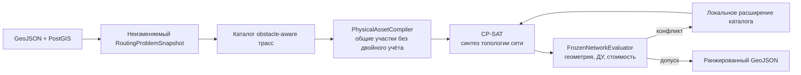

# HeatRoute

**Автоматическое проектирование предварительной схемы теплоснабжения для группы объектов**

HeatRoute принимает городской GeoJSON и за один запуск строит инженерно проверенную сеть
подключения перспективных объектов к существующей теплосети. Система выбирает точки присоединения,
обходит ограничения, объединяет ветви в общие участки, суммирует расходы, назначает ДУ и считает
стоимость. Результат можно проверить на карте и выгрузить в строгом GeoJSON.

Ключевое отличие HeatRoute от набора кратчайших путей: алгоритм оптимизирует **всю сеть как единый
физический объект**. Общий участок строится и оплачивается один раз, а его расход и диаметр
определяются суммой подключённых потребителей.

## Что уже работает

- один расчёт для всех точек спроса;
- автоматический выбор существующей камеры или допустимой новой точки присоединения;
- совместное проектирование общих стволов и ответвлений;
- обход зданий, запретных зон и линейных коммуникаций;
- подбор ДУ по агрегированному расходу и предельной непрерывной длине;
- расчёт камер, специальных участков, стоимости и рейтинга;
- независимая проверка геометрии, топологии, sizing и экономики;
- воспроизводимый запуск с SHA-256 входа и версией алгоритма;
- интерактивная карта, Swagger/OpenAPI и строгая JSON Schema результата.

Production API запускает один алгоритм HeatRoute. Профилей и переключения между разными
планировщиками нет. Если сеть не прошла точную проверку, запуск завершается с явной диагностикой.
Версия расчётного ядра записывается в `algorithm_version` каждого run.

## Как устроен алгоритм HeatRoute



1. Вход проверяется и фиксируется как неизменяемый снимок задачи.
2. Геометрический поиск строит ограниченный каталог допустимых маршрутов с учётом препятствий.
3. `PhysicalAssetCompiler` объединяет совпадающие физические участки, чтобы общий ствол не
   дублировался в модели и стоимости.
4. OR-Tools CP-SAT выбирает связную ацикличную топологию, точки присоединения и совместимые
   конфигурации узлов.
5. Точный evaluator собирает сеть, суммирует расходы, назначает ДУ и проверяет инженерные правила.
6. Если проверка находит конфликт, каталог адресно расширяется и задача решается повторно.
7. В экспорт попадает только сеть, прошедшая финальную независимую проверку.

Это bounded-поиск по инженерному каталогу, а не заявление о доказанном глобальном оптимуме на
непрерывной плоскости. Такой выбор даёт практический баланс: сложная сетевая оптимизация остаётся
управляемой по времени, а каждое опубликованное решение проходит точную проверку.

Подробнее: [алгоритм](docs/ALGORITHM.md), [контракты](docs/DATA_CONTRACTS.md) и
[киллер-фичи для жюри](docs/JURY_KILLER_FEATURES.md).

## Проверенный результат на VPS

Контрольный production-run от 29.09.2026:

| Показатель | Результат |
|---|---:|
| Сборка алгоритма | `6` |
| Точек спроса | 17 |
| Подключено | 17 из 17 |
| Время от создания run до завершения | 15,381 с повторный; 19,137 с cold |
| Длина новой сети | 2 170,113 м |
| Стоимость | 300 092 048,85 ₽ |
| Ошибки validation / engineering / sizing | 0 / 0 / 0 |

Это результат конкретного запуска на опубликованном конкурсном наборе, а не обещание одинакового
времени для любой городской геометрии. Скрытый набор может быть сложнее, поэтому время и состав
каталога будут зависеть от данных.

## Быстрый запуск

Нужны Docker Engine или Docker Desktop с Docker Compose v2 (команда `docker compose` и поддержка
флага `--wait`).

```bash
git clone https://github.com/msmrc/heatroute-lct-2026.git
cd heatroute-lct-2026
docker compose up --build -d --wait
```

После запуска:

- интерфейс: <http://localhost:5173/>;
- readiness: <http://localhost:8000/api/v1/health/ready>;
- Swagger UI: <http://localhost:8000/api/v1/swagger-ui.html>;
- OpenAPI JSON: <http://localhost:8000/api/v1/openapi>;
- JSON Schema результата: <http://localhost:8000/api/v1/official/contracts/output.schema.json>.

Публичный стенд:

- приложение: <https://130-49-150-217.sslip.io/>;
- Swagger UI: <https://130-49-150-217.sslip.io/api/v1/swagger-ui.html>;
- readiness: <https://130-49-150-217.sslip.io/api/v1/health/ready>.

Остановить локальный комплект:

```bash
docker compose down
```

Параметры окружения описаны в [`.env.example`](.env.example). Инструкция для VPS находится в
[документе развёртывания](docs/operations/VPS_DEPLOYMENT.md).

## Минимальный API-сценарий

```bash
# 1. Импортировать конкурсный набор
curl -F file=@datasets/official/lct-2026.geojson \
  http://localhost:8000/api/v1/official/imports

# 2. Создать run; вместо IMPORT_ID подставить id импорта
curl -X POST -H "Content-Type: application/json" \
  -d '{"depth_enabled":false}' \
  http://localhost:8000/api/v1/official/imports/IMPORT_ID/runs

# 3. Проверить run и выгрузить выбранный вариант
curl http://localhost:8000/api/v1/official/runs/RUN_ID
curl -o result.geojson \
  "http://localhost:8000/api/v1/official/runs/RUN_ID/export?variant_id=balanced"
```

Актуальные пути и тела запросов следует брать из Swagger. Фактический wire-ответ использует
`snake_case`; поле `algorithm_version` подтверждает версию расчётного ядра.

## Контракт данных

Вход: один GeoJSON `FeatureCollection` в EPSG:4326. Метрические операции выполняются в
EPSG:32637. Актуальный результат содержит только четыре типа объектов:

1. `heat_network`;
2. `heat_chamber`;
3. `technical_node`;
4. `variant_summary`.

Дополнительные атрибуты не подменяют обязательные. Межобъектные инварианты, которые нельзя полно
описать JSON Schema, проверяет `OfficialOutputContractValidator`.

## Технологии

| Слой | Стек |
|---|---|
| API и расчётное ядро | Java 11, Spring Boot 2.6.3 |
| Геометрия | JTS 1.20, Proj4J 1.4, PostGIS 3.5 |
| Оптимизация | OR-Tools CP-SAT 9.15 |
| Данные и задания | PostgreSQL 17, Liquibase, durable jobs |
| Интерфейс | React 19, TypeScript, Vite, MapLibre GL |
| Контракты | OpenAPI, GeoJSON, JSON Schema Draft 2020-12 |
| Поставка | Docker Compose, Nginx, Caddy |

## Проверки

```powershell
pwsh -File scripts/dev.ps1 test
pwsh -File scripts/dev.ps1 lint
pwsh -File scripts/dev.ps1 typecheck
pwsh -File scripts/dev.ps1 build
```

Тесты покрывают геометрию, топологию, CP-SAT-модель, подбор ДУ, экономику, экспорт и основные
сценарии интерфейса.

## Документация

- [Краткое описание решения](docs/CONTEST_SUBMISSION.md)
- [Киллер-фичи для жюри](docs/JURY_KILLER_FEATURES.md)
- [Сценарий демонстрации](docs/CONTEST_DEMO.md)
- [Алгоритм HeatRoute](docs/ALGORITHM.md)
- [Техническая спецификация](docs/TECH_SPEC.md)
- [Контракты данных](docs/DATA_CONTRACTS.md)
- [Критерии приёмки](docs/ACCEPTANCE.md)
- [Развёртывание на VPS](docs/operations/VPS_DEPLOYMENT.md)

Проект разработан командой **Dragons** для конкурса «Лидеры цифровой трансформации 2026».
