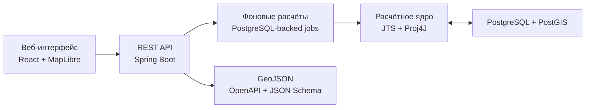

# HeatRoute

**Автоматизированное проектирование предварительных трасс тепловых сетей**

HeatRoute — геоинформационная система для поиска и инженерной оценки вариантов подключения
перспективных объектов к существующей тепловой сети. По исходным данным в формате GeoJSON система
автоматически формирует до трёх технически допустимых вариантов, учитывает ограничения территории,
подбирает точки врезки и диаметры трубопроводов, рассчитывает стоимость и ранжирует результаты.

Рассчитанные варианты доступны на интерактивной карте и выгружаются в машиночитаемом GeoJSON,
который можно независимо проверить по опубликованной JSON Schema.

## Возможности

- единый автоматический расчёт подключений для всех перспективных объектов района;
- построение независимых подключений, общей трассы и альтернативного варианта с другими врезками;
- учёт существующей сети, зданий, охранных зон, дорог, трамвайных путей и других ограничений;
- автоматический выбор точек врезки, размещение камер и формирование связной топологии сети;
- расчёт расходов, подбор диаметров и контроль предельной длины участков;
- расчёт стоимости строительства, реконструкции, штрафов и итогового рейтинга вариантов;
- независимая проверка геометрии и инженерных ограничений перед публикацией результата;
- сохранение частичного результата с диагностикой, если отдельный объект невозможно подключить;
- расчёт продольного профиля, глубин, уклонов и вертикальных пересечений;
- потоковая обработка крупных входных и выходных GeoJSON-файлов.

## Как проходит расчёт

1. Система принимает один GeoJSON и проверяет геометрию, атрибуты и связи между объектами.
2. Геометрия сохраняется в WGS 84 и переводится в EPSG:32637 для метрических вычислений.
3. По существующей сети восстанавливается топология и формируются допустимые точки врезки.
4. Для всех объектов одновременно строятся варианты трасс с учётом пространственных ограничений.
5. Трассы преобразуются в инженерную сеть: создаются участки, камеры, врезки и технические узлы.
6. По дереву сети агрегируются расходы, назначаются диаметры и проверяются ограничения по длине.
7. Рассчитываются реконструкция, стоимость, штрафы, итоговая оценка и ранг каждого варианта.
8. Независимый валидатор проверяет результат, после чего система формирует итоговый GeoJSON.

Подробное описание вычислительного процесса находится в
[документации алгоритма](docs/ALGORITHM.md).

## Архитектура



Расчётное ядро отделено от HTTP-слоя. Состояние заданий и результаты хранятся в PostgreSQL, поэтому
длительный расчёт можно продолжить после перезапуска приложения. Геометрические операции выполняются
в метрической системе координат, а API принимает и возвращает данные в WGS 84.

### Технологический стек

| Слой | Технологии |
|---|---|
| Серверная часть | Java 11, Spring Boot 2.6.3, Spring JDBC, Spring Batch |
| Геообработка | JTS 1.20, Proj4J 1.4, PostGIS 3.5 |
| Хранение данных | PostgreSQL 17, Liquibase |
| Веб-интерфейс | React 19, TypeScript, Vite, MapLibre GL, TanStack Query, Zustand |
| API и контракты | REST, OpenAPI/Swagger, GeoJSON, JSON Schema Draft 2020-12 |
| Инфраструктура | Docker Compose, Nginx, Caddy |
| Тестирование | JUnit, Testcontainers, Vitest, Testing Library, ESLint |

## Входные данные и результат

На вход передаётся GeoJSON `FeatureCollection` в EPSG:4326. Поддерживаются источники тепла,
существующие участки сети и камеры, перспективные и существующие здания, точки подключения и
пространственные ограничения.

Система поддерживает два профиля входных данных:

- **базовый конкурсный профиль** — построение, оценка и экспорт обязательного 2D-результата по
  предоставленному набору данных;
- **расширенный инженерный профиль** — дополнительно использует расходы, направления и диаметры
  существующей сети для расчёта её реконструкции.

Результат содержит новые участки сети, врезки, камеры, технические узлы, необходимые мероприятия
по реконструкции и сводные показатели вариантов. Для каждого результата сохраняются SHA-256
исходного файла, версии контракта, алгоритма и инженерных справочников.

Точные поля и правила валидации описаны в [контрактах данных](docs/DATA_CONTRACTS.md), а их
машиночитаемые версии находятся в каталоге [`docs/contracts`](docs/contracts/README.md).

## Быстрый запуск

Для запуска полного приложения потребуются Docker Engine или Docker Desktop с поддержкой
Docker Compose.

```bash
git clone https://github.com/msmrc/heatroute-lct-2026.git
cd heatroute-lct-2026
docker compose up --build -d --wait
```

После запуска доступны:

- веб-интерфейс: <http://localhost:5173/>;
- проверка готовности API: <http://localhost:8000/api/v1/health/ready>;
- Swagger UI: <http://localhost:8000/api/v1/swagger-ui.html>;
- JSON Schema результата: <http://localhost:8000/api/v1/official/contracts/output.schema.json>.

Остановить приложение:

```bash
docker compose down
```

Порты и локальные параметры можно изменить через переменные из [`.env.example`](.env.example).
Для production-окружения используется отдельная конфигурация без тестовых значений секретов.

### Запуск интерфейса в режиме разработки

Потребуются Node.js 22 и pnpm 9 или новее.

```bash
docker compose up --build -d --wait db api
pnpm install --frozen-lockfile
pnpm dev
```

Vite запустит интерфейс на <http://localhost:5173/> и направит запросы `/api` на локальную
серверную часть.

## Проверки

Полный набор проверок можно запустить через PowerShell 7:

```powershell
pwsh -File scripts/dev.ps1 test
pwsh -File scripts/dev.ps1 lint
pwsh -File scripts/dev.ps1 typecheck
pwsh -File scripts/dev.ps1 build
```

Или отдельными командами:

```bash
docker build --target test -f infra/docker/backend.Dockerfile -t heatroute-api:test .
pnpm test
pnpm lint
pnpm typecheck
pnpm build
```

Тесты проверяют расчётные таблицы, геометрические ограничения, топологию сети, контракты API,
формат экспорта и пользовательские сценарии интерфейса.

## Структура репозитория

```text
apps/
  api/                  Java API и расчётное ядро
  web/                  React-интерфейс и интерактивная карта
datasets/official/      Конкурсный набор геоданных
docs/                   Техническая и конкурсная документация
  contracts/            JSON Schema входных и выходных данных
infra/                  Docker-образы, Nginx и Caddy
packages/api-client/    Версионируемый OpenAPI-контракт клиента
scripts/                Команды разработки, тестирования и демонстрации
```

## Документация

- [Краткое описание конкурсного решения](docs/CONTEST_SUBMISSION.md)
- [Сценарий демонстрации](docs/CONTEST_DEMO.md)
- [Алгоритм расчёта](docs/ALGORITHM.md)
- [Техническая спецификация](docs/TECH_SPEC.md)
- [Контракты данных](docs/DATA_CONTRACTS.md)
- [Критерии приёмки](docs/ACCEPTANCE.md)
- [Развёртывание](docs/operations/VPS_DEPLOYMENT.md)

Проект разработан командой **Dragons** для конкурса «Лидеры цифровой трансформации 2026».
