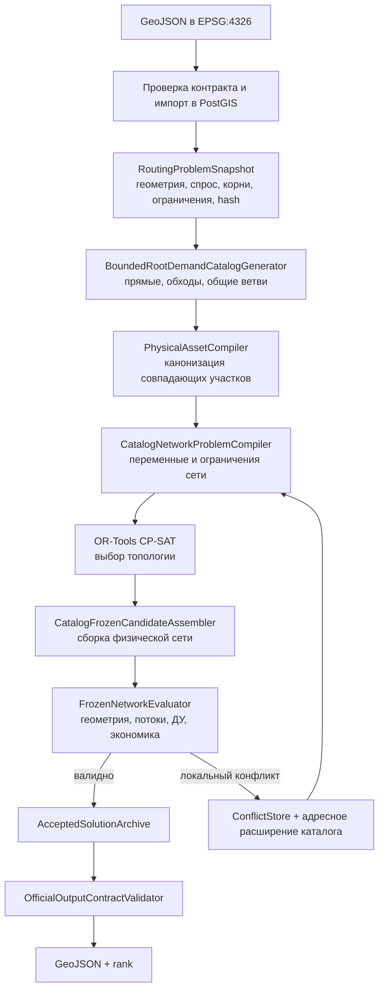

# Алгоритм HeatRoute: построение тепловой сети

## Какую задачу решает алгоритм

Обычный поиск кратчайшего пути решает задачу «точка-точка». В HeatRoute задача другая: нужно
одновременно подключить группу ОКС, решить, где использовать общий ствол, где разделить ветви,
какие камеры и присоединения создать, как изменится расход и какой ДУ нужен каждому непрерывному
участку.

HeatRoute решает эту задачу как синтез сети. Геометрический поиск отвечает за физически допустимые
траектории, CP-SAT выбирает их совместимую комбинацию, а независимый evaluator проверяет уже
собранный физический результат.

## Вычислительный контур



## 1. Неизменяемый снимок задачи

После импорта данные фиксируются в `RoutingProblemSnapshot`. В снимок входят потребители,
допустимые корни подключения, препятствия, существующая сеть и версии правил. Для него считается
hash. Это исключает ситуацию, когда оптимизатор решает одну геометрию, а финальный валидатор
проверяет уже другую.

Все метрические операции выполняются в EPSG:32637. Граница API и итоговая выгрузка остаются в
EPSG:4326.

## 2. Каталог физических трасс

`BoundedRootDemandCatalogGenerator` строит не одну линию, а ограниченный набор инженерно
осмысленных кандидатов:

- пути от корней к точкам спроса;
- обходы препятствий;
- допустимые точки присоединения;
- общие ветви для нескольких потребителей;
- альтернативы, которые могут снять локальный конфликт сети.

Каталог bounded: число кандидатов и время поиска ограничены настройками production-контура. Это
делает время решения управляемым. Если точный evaluator отклоняет выбранную комбинацию, HeatRoute
расширяет проблемную область, а не запускает полный геометрический перебор заново.

## 3. Канонические physical assets

Два маршрута могут частично идти по одной оси. Если передать их оптимизатору как независимые линии,
одна и та же труба будет дважды учтена в длине и стоимости. `PhysicalAssetCompiler` режет
кандидаты по общим точкам, канонизирует совпадающие сегменты и создаёт один физический asset с
несколькими возможными потребителями.

Это центральное свойство модели: общая инфраструктура существует в CP-SAT один раз. После выбора
сети на ней агрегируется суммарный расход, а стоимость считается по итоговому ДУ общего участка.

## 4. CP-SAT master-модель

`CatalogNetworkProblemCompiler` переводит каталог в дискретную модель. CP-SAT выбирает:

- используемые физические участки;
- направления потока к корню;
- конфигурации камер и узлов;
- подключение каждой точки спроса;
- совместимые общие стволы и ответвления.

Ограничения модели обеспечивают связность, отсутствие запрещённых циклов, один upstream для
нерутового узла, допустимые конфигурации узлов и непротиворечивый выбор физических assets.
Стоимость выбранного asset входит в целевую функцию один раз.

CP-SAT не подменяет геометрию. Он оптимизирует только по проверенному каталогу и передаёт найденную
комбинацию точному сборщику.

## 5. Frozen-сборка и точный допуск

`CatalogFrozenCandidateAssembler` превращает решение CP-SAT в неизменяемую сеть. Затем
`FrozenNetworkEvaluator` выполняет проверки, которые нельзя безопасно заменить приближённой
линейной моделью:

1. собирает полилинии и узлы;
2. проверяет пересечения и пространственные ограничения;
3. суммирует расходы от потребителей к корню;
4. назначает минимальный допустимый ДУ;
5. контролирует непрерывную длину участка одного ДУ;
6. рассчитывает специальные участки, камеры и стоимость;
7. проверяет топологию и арифметические инварианты.

Если найден локальный конфликт, его literals и evidence сохраняются в `ConflictStore`. Следующий
CP-SAT-запуск исключает несовместимую комбинацию или использует адресно расширенный каталог.

## 6. Ранжирование и экспорт

До трёх materially different решений сохраняются в `AcceptedSolutionArchive`. Три варианта не
создаются искусственно: если найден один действительно допустимый вариант, API честно возвращает
один.

`score` применяется только для сравнения вариантов одного запуска. Он не подменяет конкурсные
критерии жюри. Перед первым байтом экспорта `OfficialOutputContractValidator` повторно проверяет
типы, поля, ссылки, уникальность ID, WGS84 и наличие summary.

Актуальная выгрузка содержит четыре типа объектов:

- `heat_network`;
- `heat_chamber`;
- `technical_node`;
- `variant_summary`.

## Единый production-контур

`HeatRouteRoutingAlgorithm` напрямую вызывает `HeatRoutePlanner`. Других production-планировщиков
и профилей алгоритма нет. При незавершённом расчёте адаптер возвращает ошибку с диагностикой и не
публикует непроверенный результат.

Проверка конкретного run:

```bash
curl https://130-49-150-217.sslip.io/api/v1/official/runs/latest
```

Поле `algorithm_version` должно начинаться с `heatroute-network-`.

## Сложность и границы

Исходная задача сочетает constrained Steiner network design, геометрический поиск и дискретный
подбор инженерных параметров. Точный перебор всех возможных точек плоскости практически
непригоден. HeatRoute использует ограниченный каталог и итеративное уточнение, поэтому:

- каждое опубликованное решение проходит точную проверку;
- результат детерминирован при одинаковом снимке, версиях и параметрах;
- найденный вариант не объявляется доказанным глобальным оптимумом непрерывной задачи;
- время зависит от плотности препятствий и числа необходимых расширений каталога.

На повторном контрольном production-run от 29.09.2026 сборка алгоритма 6 подключила 17 из
17 точек за 15,381 с между созданием и завершением run; cold run занял 19,137 с. Итоговый вариант
имеет ноль `validation_issues`, `engineering_issues` и `sizing_issues`.

## Источники правил

Приоритет источников и действующие письменные разъяснения организаторов от 29.09.2026 собраны в
[ACTIVE_ROUTING_RULES.md](implementation/ACTIVE_ROUTING_RULES.md). Документы и тесты не должны
возвращать отменённые трактовки, в частности:

- железная дорога является запрещённым пересечением, а не псевдонимом трамвая;
- до трёх вариантов допустимы, но не обязательны;
- минимального расстояния между новыми камерами организатор не задаёт;
- любой поворот с изменением направления не более 90° допустим без отдельного коэффициента;
- optional depth не блокирует обязательный 2D-результат.
